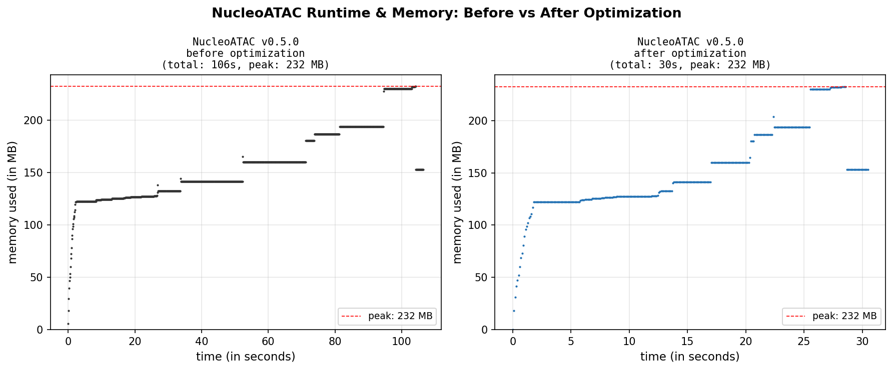

# NucleoATAC2

**NucleoATAC** infers nucleosome positions and occupancy from ATAC-seq data using a probabilistic V-plot model. NucleoATAC2 is a fork of [GreenleafLab/NucleoATAC](https://github.com/GreenleafLab/NucleoATAC) (Alicia Schep, Greenleaf Lab). We did an AI-assisted port to Python 3, extended the package to accept tabix-indexed fragment files, and substantially improved runtime through optimization and parallelization.

> Schep et al. (2015) *Structured nucleosome fingerprints enable high-resolution mapping of chromatin architecture within regulatory regions.* Genome Research. [doi:10.1101/gr.192294.115](http://genome.cshlp.org/content/25/11/1757)


## Method overview

NucleoATAC models the size and position distribution of ATAC-seq fragments around candidate nucleosome positions. The core idea is that 1) nucleosomal DNA is typically associated with longer ATAC-seq fragments, and therefore 2) nucleosomal DNA produces a characteristic **V-plot** — a 2D histogram of fragment midpoint position vs. fragment size — with nucleosome-sized fragments (≥150 bp) centered on the dyad and sub-nucleosomal fragments (NFR) flanking it.

The pipeline has five steps:

```
occ → vprocess → nuc → merge → nfr
```

| Step | Command | What it does |
|------|---------|-------------|
| Occupancy | `nucleoatac occ` | Fits a two-component mixture model (NFR + nucleosomal) to the fragment size distribution at each peak. Reports per-position occupancy (0–1) and confidence bounds. |
| V-plot processing | `nucleoatac vprocess` | Normalizes the V-plot template to the observed nucleosomal insert size distribution. |
| Nucleosome calling | `nucleoatac nuc` | Convolves the normalized V-plot over each peak. Reports a nucleosome signal track, smoothed signal, and discrete peak calls with LLR scores. |
| Merge | `nucleoatac merge` | Combines occupancy peaks and nucleosome position calls into a single unified set. |
| NFR calling | `nucleoatac nfr` | Identifies nucleosome-free regions between adjacent nucleosome calls. |

**Inputs:** ATAC-seq alignment (BAM or tabix-indexed BED fragments), peak regions (BED), reference genome (FASTA).
**Outputs:** Occupancy track, nucleosome signal track, nucleosome position calls, NFR calls — all as gzipped, tabix-indexed bedgraph/BED files.


## Installation

Clone the repository, and then:

```bash
conda create -n nucleoatac python=3.12
conda activate nucleoatac
pip install --editable .
```

Verify:

```bash
nucleoatac --version
pyatac --version
```


## Quick start

```bash
# Run the full pipeline in one command
nucleoatac run \
  --bed peaks.bed \
  --bam data.bam \
  --fasta genome.fa \
  --out results/sample \
  --cores 8
```

Or run steps individually for more control (see [readthedocs](http://nucleoatac.readthedocs.org/en/latest/) for options):

```bash
nucleoatac occ      --bed peaks.bed --bam data.bam --fasta genome.fa --out sample --cores 8
nucleoatac vprocess --sizes sample.nuc_dist.txt --out sample
nucleoatac nuc      --bed peaks.bed --bam data.bam --fasta genome.fa \
                    --vmat sample.VMat --occ_track sample.occ.bedgraph.gz --out sample --cores 8
nucleoatac merge    --occpeaks sample.occpeaks.bed.gz --nucpos sample.nucpos.bed.gz --out sample
nucleoatac nfr      --bed peaks.bed --bam data.bam --fasta genome.fa \
                    --occ_track sample.occ.bedgraph.gz --calls sample.nucmap_combined.bed.gz --out sample
```


## New features in this fork

### Fragment file support

Commands that previously required a BAM file now accept a **tabix-indexed BED fragments file** via `--fragments`:

```bash
nucleoatac occ --fragments sample.fragments.tsv.gz --bed peaks.bed --fasta genome.fa --out sample
nucleoatac nuc --fragments sample.fragments.tsv.gz ...
pyatac sizes   --fragments sample.fragments.tsv.gz --bed peaks.bed --out sample
```

The fragments file is expected to be coordinate-sorted, bgzip-compressed, and tabix-indexed.

### HPC parallelization

Both `occ` and `nuc` accept `--sizes` (a pre-computed fragment size distribution) and `--chroms_keep` (restrict to one chromosome), enabling parallel array jobs across chromosomes.

**Option A — parallel `nuc` only** (recommended; `occ` already parallelizes internally):

```bash
# Phase 1: global occ + vprocess (once, uses internal multiprocessing)
nucleoatac occ     --bed peaks.bed --bam data.bam --fasta genome.fa --out global --cores 8
nucleoatac vprocess --sizes global.nuc_dist.txt --out global

# Phase 2: per-chromosome nuc (one HPC job per chromosome)
for chrom in chr1 chr2 ...; do
  nucleoatac nuc --bed peaks.bed --bam data.bam --fasta genome.fa \
    --chroms_keep $chrom \
    --sizes     global.fragmentsizes.txt \
    --vmat      global.VMat \
    --occ_track global.occ.bedgraph.gz \
    --out per_chrom/$chrom --cores 4 &
done; wait

# Phase 3: merge + downstream (once)
nucleoatac merge_chroms --prefix per_chrom/chr --chroms chr1,chr2,... --out merged
nucleoatac merge  --occpeaks global.occpeaks.bed.gz --nucpos merged.nucpos.bed.gz --out merged
nucleoatac nfr    --bed peaks.bed --bam data.bam --fasta genome.fa \
    --occ_track global.occ.bedgraph.gz --calls merged.nucmap_combined.bed.gz --out merged
```

See [`scripts/run_parallel_nuc.sh`](scripts/run_parallel_nuc.sh) for a ready-to-use script.

**Option B — parallel `occ` + `nuc`** (for large genomes where `occ` is also a bottleneck): run a lightweight global `pyatac sizes`, then run per-chromosome `occ` and `nuc` jobs independently, then `merge_chroms` twice. See the script for details.

### Python 3 port

The codebase has been ported from Python 2.7 to Python 3 (≥3.9). All 15 pipeline outputs agree with the Python 2 reference to within floating-point epsilon:


## Performance optimizations

Four bottleneck functions were rewritten to replace Python loops with vectorized NumPy:

| Function | Change | Speedup |
|----------|--------|---------|
| `calculateOccupancy()` | NumPy broadcast + matmul replaces 101-iteration Python `map` loop | **8.2×** (1.56 ms → 0.19 ms) |
| `calculateCov()` | O(n²) Cython double-loop → O(n) closed-form (`r·(p·v² − (p·v)²)`) | **8,912×** (234 ms → 0.026 ms) |
| `makeFragmentMat()` | Vectorized index computation + `np.add.at` replaces per-fragment loop | **2.8×** (6.5 ms → 2.3 ms) |
| `makeBiasMat()` | Closed-form index slicing replaces 2,000 `np.convolve` calls | **9.5×** (9.9 ms → 1.0 ms) |

**End-to-end on example data (2 cores): 106 s → 30 s (3.5× faster). Peak memory unchanged (232 MB).**




All optimizations are numerically equivalent to the original: all outputs pass the full regression test suite at `atol=1e-5`.


## Running tests

```bash
python -m pytest tests/ -v                                  # full suite (~30s)
python -m pytest tests/ -v --ignore=tests/test_regression.py  # unit tests only
python -m pytest tests/test_regression.py::TestPy2Regression -v  # numerical parity
```


## Repository structure

```
NucleoATAC/
├── nucleoatac/          # Occupancy + nucleosome calling pipeline
├── pyatac/              # General ATAC-seq utilities
├── bin/                 # CLI entry points (nucleoatac, pyatac)
├── scripts/             # Helper shell scripts
├── tests/               # Test suite
│   ├── py2_reference/   # Frozen Python 2.7 outputs for regression testing
│   └── test_*.py        # Unit + regression tests
└── example/             # Example yeast (sacCer3) dataset
```


## Citation

If you use NucleoATAC, please cite the original paper:

> Schep AN, Buenrostro JD, Denny SK, Bhargava V, Sherlock G, Greenleaf WJ. *Structured nucleosome fingerprints enable high-resolution mapping of chromatin architecture within regulatory regions.* Genome Res. 2015 Nov;25(11):1757-70.
