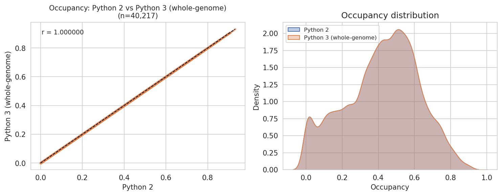
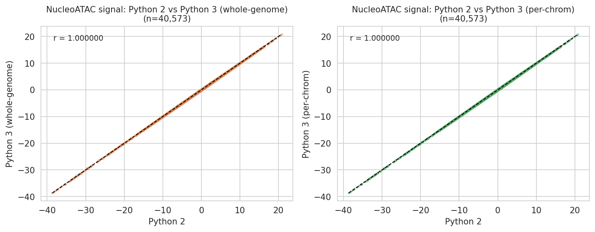
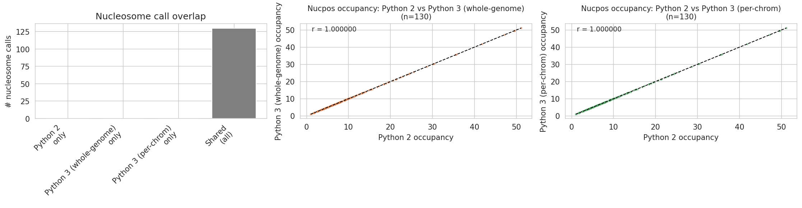
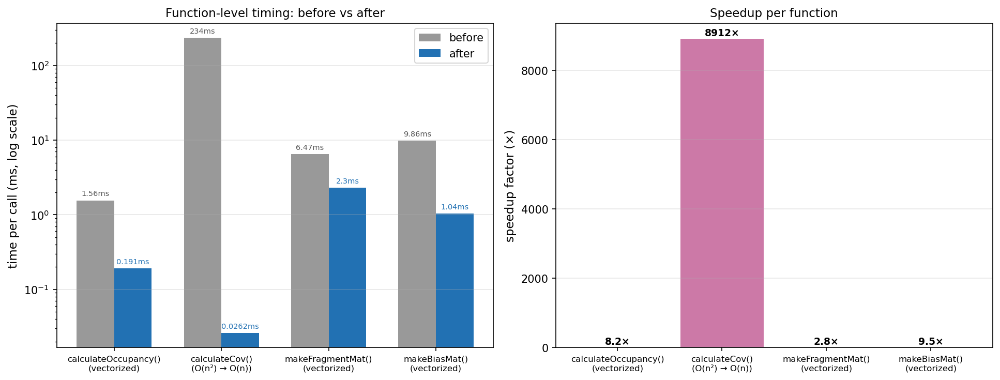

# NucleoATAC

Fork of [GreenleafLab/NucleoATAC](https://github.com/GreenleafLab/NucleoATAC) (Alicia Schep, Greenleaf Lab) updated for Python 3 and extended to accept tabix-indexed fragment files as input. Original paper: [Schep et al., *Genome Research* 2015](http://genome.cshlp.org/content/25/11/1757).

---

## What's new in this fork

### 1. Fragments file support (2024-08)

Commands that previously required a BAM file now accept a tabix-indexed BED fragments file via `--fragments`:

- `pyatac sizes`
- `nucleoatac occ`
- `nucleoatac nuc`

New module: `nucleoatac/fragments_handling.py` — tabix-based fragment fetching, chunk extraction, and optional chromosome filtering (`--chroms_keep`).

### 2. Python 3 port (2024–2025)

The codebase has been fully ported from Python 2.7 to Python 3 (≥3.9). All changes are verified numerically identical to the Python 2 reference outputs.

**Changes made:**
- Syntax: `print()`, `except ... as e`, relative imports (~30 files)
- Semantics: `xrange`→`range`, integer division `/`→`//` (~30 sites), `map()`→`list(map())`, `gzip.open("rt")`, `str.maketrans`, `functools.cmp_to_key`
- Library: `pysam.Samfile`→`AlignmentFile`; `np.float`→`np.float64`; subprocess bytes decode
- Cython: `language_level = "3"` in both `.pyx` files
- Build: `setup.py` updated to `python_requires='>=3.9'`; `pyproject.toml` added

**Regression parity (Python 2 vs Python 3):**

All 15 output files agree to within floating-point epsilon on the example dataset:

| Output | Pearson r | Max absolute diff |
|---|---|---|
| Occupancy track (40,217 positions) | 1.000000 | 3.3 × 10⁻¹⁶ |
| NucleoATAC signal (40,573 positions) | 1.000000 | 1.7 × 10⁻¹³ |
| Nucleosome calls (130 peaks) | 1.000000 | — (exact same positions) |
| Fragment size distribution | — | 0 (identical) |
| Nucleosomal insert distribution | — | 4.4 × 10⁻¹⁶ |





### 3. Performance optimizations (2025)

Four hot-path functions were rewritten to replace Python loops with vectorized NumPy operations:

| Function | Change | Speedup |
|---|---|---|
| `calculateOccupancy()` | Numpy broadcast + matmul replaces 101-call Python `map` loop | **8.2×** (1.56 ms → 0.19 ms) |
| `calculateCov()` | O(n²) Cython double-loop → O(n) closed-form numpy (`r·(p·v² − (p·v)²)`) | **8,912×** (234 ms → 0.026 ms) |
| `makeFragmentMat()` | Vectorized index computation + `np.add.at` replaces per-fragment Python loop | **2.8×** (6.5 ms → 2.3 ms) |
| `makeBiasMat()` | Direct closed-form index slicing replaces 2,000 `np.convolve` calls | **9.5×** (9.9 ms → 1.0 ms) |

**End-to-end pipeline speedup on example data (2 cores):**



106 seconds → 30 seconds (**3.5× faster**). Peak memory unchanged (232 MB).

All optimizations are numerically equivalent to the original: outputs pass the full regression test suite at `atol=1e-5`.

### 4. HPC parallelization (2025)

Both `nucleoatac occ` and `nucleoatac nuc` support a `--sizes` argument that accepts a pre-computed fragment size distribution, allowing either step to skip genome-wide fitting and run independently per chromosome. Combined with `--chroms_keep` and `nucleoatac merge_chroms`, the full pipeline can be parallelized across chromosomes in HPC array jobs.

#### Option A: parallel `nuc` only (recommended for most cases)

`occ` is run once genome-wide (it already uses chunk-level multiprocessing internally). Only `nuc` — the V-plot convolution bottleneck — is parallelized per chromosome:

```bash
# Phase 1: global occ + vprocess (once)
nucleoatac occ     --bed peaks.bed --bam data.bam --fasta genome.fa --out global --cores 8
nucleoatac vprocess --sizes global.nuc_dist.txt --out global

# Phase 2: per-chromosome nuc (HPC array jobs)
for chrom in chr1 chr2 ...; do
  nucleoatac nuc --bed peaks.bed --bam data.bam --fasta genome.fa \
    --chroms_keep $chrom \
    --sizes     global.fragmentsizes.txt \
    --vmat      global.VMat \
    --occ_track global.occ.bedgraph.gz \
    --out per_chrom/$chrom --cores 4 &
done; wait

# Phase 3: merge + downstream steps (once)
nucleoatac merge_chroms --prefix per_chrom/chr --chroms chr1,chr2,... --out merged
nucleoatac merge  --occpeaks global.occpeaks.bed.gz --nucpos merged.nucpos.bed.gz --out merged
nucleoatac nfr    --bed peaks.bed --bam data.bam --fasta genome.fa \
    --occ_track global.occ.bedgraph.gz --calls merged.nucmap_combined.bed.gz --out merged
```

See [`scripts/run_parallel_nuc.sh`](scripts/run_parallel_nuc.sh) for a ready-to-use script.

#### Option B: parallel `occ` + `nuc` (large genomes with many peaks)

For datasets where `occ` is also a bottleneck, both steps can be parallelized. A lightweight global `pyatac sizes` run provides the shared fragment size distribution without computing occupancy:

```bash
# Phase 0: global fragment sizes only (lightweight)
pyatac sizes --bam data.bam --bed peaks.bed --out global

# Phase 1: per-chromosome occ (HPC array jobs)
for chrom in chr1 chr2 ...; do
  nucleoatac occ --bed peaks.bed --bam data.bam --fasta genome.fa \
    --chroms_keep $chrom \
    --sizes global.fragmentsizes.txt \
    --out per_chrom_occ/$chrom --cores 4 &
done; wait

# Phase 2: merge occ outputs + vprocess (once)
nucleoatac merge_chroms --prefix per_chrom_occ/chr --chroms chr1,chr2,... --out merged_occ
nucleoatac vprocess --sizes merged_occ.nuc_dist.txt --out merged_occ

# Phase 3: per-chromosome nuc (HPC array jobs)
for chrom in chr1 chr2 ...; do
  nucleoatac nuc --bed peaks.bed --bam data.bam --fasta genome.fa \
    --chroms_keep $chrom \
    --sizes     global.fragmentsizes.txt \
    --vmat      merged_occ.VMat \
    --occ_track merged_occ.occ.bedgraph.gz \
    --out per_chrom_nuc/$chrom --cores 4 &
done; wait

# Phase 4: merge nuc + downstream steps (once)
nucleoatac merge_chroms --prefix per_chrom_nuc/chr --chroms chr1,chr2,... --out merged_nuc
nucleoatac merge --occpeaks merged_occ.occpeaks.bed.gz --nucpos merged_nuc.nucpos.bed.gz --out merged
nucleoatac nfr   --bed peaks.bed --bam data.bam --fasta genome.fa \
    --occ_track merged_occ.occ.bedgraph.gz --calls merged.nucmap_combined.bed.gz --out merged
```

**Key:** passing `--sizes` to both `occ` and `nuc` ensures all chromosomes share the same fragment size distribution fitted in Phase 0. The per-chromosome results are numerically identical to a single genome-wide run.

---

## Installation

```bash
conda create -n nucleoatac2 python=3.12
conda activate nucleoatac2
pip install --editable .
```

Test the install:

```bash
nucleoatac --version
pyatac --version
```

## Running tests

```bash
PYTHON=/oak/stanford/groups/akundaje/sjessa/software/miniconda3/envs/nucleoatac2/bin/python

# Full test suite (unit + regression, ~30s)
$PYTHON -m pytest tests/ -v

# Unit tests only (~seconds)
$PYTHON -m pytest tests/ -v --ignore=tests/test_regression.py

# Regression: Python 3 vs Python 2 reference
$PYTHON -m pytest tests/test_regression.py::TestPy2Regression -v

# Regression: per-chromosome parallel == genome-wide
$PYTHON -m pytest tests/test_regression.py::TestParallelNucConsistency -v
```

## Repository structure

```
NucleoATAC/
├── nucleoatac/              # nucleoatac package (occupancy + nucleosome calling)
├── pyatac/                  # pyatac package (general ATAC-seq utilities)
├── bin/                     # CLI entry points (nucleoatac, pyatac)
├── scripts/                 # Helper shell scripts (e.g. run_parallel_nuc.sh)
├── tests/                   # Test suite
│   ├── py2_reference/       # Frozen Python 2.7 outputs used for regression testing
│   ├── test_regression.py   # Regression tests (Python 3 vs py2_reference, ~30s)
│   ├── test_cli.py          # CLI smoke tests (each subcommand runs without error)
│   └── test_*.py            # Unit tests (occupancy math, tracks, peak calling, etc.)
└── example/                 # Example yeast (S. cerevisiae) dataset
    ├── example.bam          # ATAC-seq reads (subset of a yeast BAM)
    ├── example.bed          # Peak regions to analyse
    ├── sacCer3.fa           # Reference genome (S. cerevisiae sacCer3)
    ├── example.Scores.bedgraph.gz  # Pre-computed Tn5 bias scores
    ├── example.VMat         # Default V-plot template
    ├── example_results/     # Pre-computed Python 2.7 outputs (committed to git)
    │                        #   used as inputs for individual-step CLI tests
    └── test_results/        # Transient output from CLI test runs (gitignored)
```

`example/example_results/` is checked into the repository. It contains a complete Python 2.7 pipeline run on the example dataset and serves two purposes: (1) it lets `test_cli.py` test individual pipeline steps in isolation (e.g. `nucleoatac nuc` can read a pre-existing VMat without re-running `occ` first), and (2) it is the upstream Greenleaf Lab reference output. It is distinct from `tests/py2_reference/`, which holds the same run's outputs in a format optimised for numerical comparison by `test_regression.py`.

---

## Pipeline overview

```
occ → vprocess → nuc → merge → nfr
```

| Step | Description |
|---|---|
| `nucleoatac occ` | Occupancy track + fragment size distribution |
| `nucleoatac vprocess` | Process V-plot template |
| `nucleoatac nuc` | Nucleosome signal tracks + position calls |
| `nucleoatac merge` | Combine occupancy peaks and nucleosome calls |
| `nucleoatac nfr` | Call nucleosome-free regions |
| `nucleoatac run` | Full pipeline (chains all above) |
| `nucleoatac merge_chroms` | Merge per-chromosome outputs from parallel runs |

---

## Previously (original README)

**This package is no longer being actively maintained by the Greenleaf Lab; feel free to post issues that others in the community may respond to.**

Python package for calling nucleosomes using ATAC-seq data. Also includes general scripts for working with paired-end ATAC-seq data.

Please cite: [Schep et al., *Genome Research* 2015](http://genome.cshlp.org/content/25/11/1757).

Documentation: http://nucleoatac.readthedocs.org/en/latest/

Note on Versions:
* version 0 represents code used for biorxiv manuscript
* version 0.2.1 was used for Genome Research manuscript (See Supplemental Information as well)
